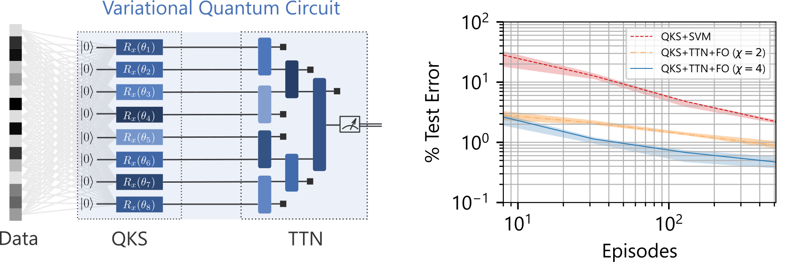

# Image Classification by Throwing Quantum Kitchen Sinks at Tensor Networks - TensorFlow Implementation
**Nathan X. Kodama** (Case Western Reserve University), **Alex Bocharov** (Microsoft Quantum), **Marcus P. da Silva** (Microsoft Quantum)

**Abstract**: Several variational quantum circuit approaches to machine learning have been proposed in recent years, with one promising class of variational algorithms involving tensor networks operating on states resulting from *local feature maps*. In contrast, a random feature approach known as quantum kitchen sinks provides comparable performance, but leverages *non-local feature maps*. Here we combine these two approaches by proposing a new circuit ansatz where a tree tensor network coherently processes the non-local feature maps of quantum kitchen sinks, and we run numerical experiments to empirically evaluate the performance of image classification with the new ansatz. From the perspective of classification performance, we find that simply combining quantum kitchen sinks with tensor networks yields no qualitative improvements. However, the addition of *feature optimization* greatly boosts performance, leading to state-of-the-art quantum circuits for image classification, requiring only shallow circuits and a small number of qubits — both well within reach of near-term quantum devices.

## Introduction
This repository contains code to generate data and reproduce experiments from [Image Classification by Throwing Quantum Kitchen Sinks at Tensor Networks](https://arxiv.org/abs/2208.13895).

## Getting Started
The `qks-tn-library` requires the installation of several dependencies (see `requirements.txt`). We created a Jupyter notebook, `qks-tn-library\train_and_evaluate_qks_ttn.ipynb`, that builds, trains, and evaluates a QKS+TTN model equipped with feature optimization.

### Requirements
We tested the code in a virtual Python environment running
* Python (3.10.6)
* JupyterLab (3.4.1)
* TensorFlow (2.9.1)

Additional requirements:
* TensorFlow Addons (0.17.1): the AdamW optimizer (https://www.tensorflow.org/addons/api_docs/python/tfa/optimizers/AdamW) is used to train the TensorFlow model.
* TensorNetwork (0.4.6): the connectivity and contraction paths of the tensor network are defined with this TensorFlow-compatible library. See  https://tensornetwork.readthedocs.io/en/latest/ (on GitHub at https://github.com/google/TensorNetwork)

### Install and Run
Steps to install and run:
1. Install the requirements above with `pip install -r requirements.txt`.
2. Open the Jupyter notebook, `qks-tn-library\train_and_evaluate_qks_ttn.ipynb`, and run all cells to train and evaluate a QKS+TTN model.
3. Adjust the model and optimizer parameters for the QKS and TTN to train more expressive models.
